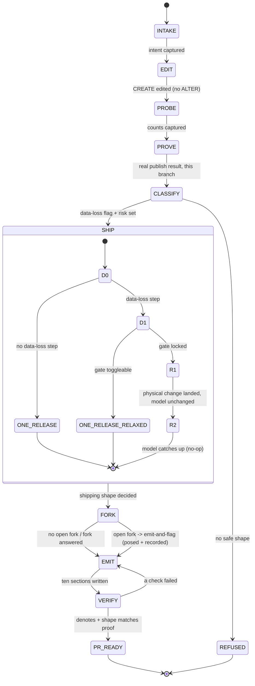

# THE DECISION TREE — the authoring state machine

This is the state machine `change-author` runs to turn one change request into one pull request.
It is a state machine on purpose: an agent moves through the states in order and **cannot leave a
state until that state's exit guard holds**. There is no path that skips proving, skips a human
fork, or ships a data-loss change this pipeline would reject. Following it firmly is what protects
the outcome — every choice we have made is a state or a guard here, and a guard cannot be waved
through. `THE_RECORD_FORMS.md` governs the words each state emits; `FINDINGS_AND_CHANGES.md` holds
the proofs the guards rest on.

---

## Invariants — true in every state

- **The developer is the author; the agent is invisible.** It never refers to itself. It writes
  on the developer's behalf, to the reviewer.
- **Prove, do not guess.** Every classification comes from a real publish to a throwaway copy of
  the database, on this branch. A prior run is never this change's proof.
- **Referent, not reference.** Every sentence names a fact — a count, an object, a message — or it
  is cut.
- **Plain words.** A global team reads this; explain each SQL term once. Bullets, short.
- **Direct imperatives to the reviewer:** `Confirm…` · `Schedule…` · `Check with…`.
- **A remedy adds no permanent schema.** A new table, column, or constraint is a product decision
  with its own PR. If a fix seems to need one, the machine routes to FORK — it never builds.

---

## The states

Each state names: **enter when** · **do** · **leave when** (the exit guard) · **then**.

### S0 · INTAKE
- **Enter when:** a change request (PBI) arrives.
- **Do:** name the object, the operation, and the developer's intent.
- **Leave when:** object + operation + intent are captured.
- **Then:** → EDIT. **Emits** *Intent*.

### S1 · EDIT
- **Do:** edit the `CREATE` to the target shape. Never write `ALTER` — DacFx computes the difference.
- **Leave when:** the desired-state `.sql` edit exists and contains no `ALTER`.
- **Then:** → PROBE. **Emits** *What changes*.

### S2 · PROBE
- **Do:** on a throwaway copy, answer the three questions — is the table populated? does existing
  data break the new rule? must old and new app code run at once?
- **Leave when:** the counts and the violating rows are captured.
- **Then:** → PROVE. **Emits** *The data*.

### S3 · PROVE  *(the guard that cannot be waved through)*
- **Do:** publish the change to the copy under the safe default. If refused, record the exact
  `Msg`, take the next real step, publish again — until it applies. Publish once more unchanged to
  confirm it is a no-op.
- **Leave when:** a **real publish result from this branch** is captured — either "applied", or a
  refusal with its verbatim message. **No exit on a prior run, a precedent, or a guess.**
- **Then:** → CLASSIFY. **Emits** *What proving showed* (tried / did / realized).

### S4 · CLASSIFY
- **Do:** from the proof, read two facts: (a) did DacFx generate a **data-loss step** (a narrow, a
  drop, a populated `NOT NULL`, a lossy retype — the row-presence guard or a `DROP`)? (b) the
  **risk row** (`THE_RECORD_FORMS.md` verdict table).
- **Leave when:** the data-loss flag and the risk are set.
- **Then:** → SHIP.

### S5 · SHIP  *(the deployment sub-machine — see below)*
- **Do:** run the sub-machine to a terminal — ONE_RELEASE, ONE_RELEASE_RELAXED, or TWO_RELEASE.
- **Leave when:** a shipping terminal is reached.
- **Then:** → FORK. **Emits** *How it ships* + *Before promoting*.

### S6 · FORK
- **Do:** if PROVE surfaced a decision only a human can make — an orphan to delete or reassign, a
  value to truncate, a NULL to backfill — pose one structured question (measured fact · 2–4
  options each with consequence, cost, and a schema line · a custom slot · one question).
- **Leave when:** the fork is posed and recorded — its answer if it has one, its question if not
  (with the owner who can answer, where one is known).
- **Then:** → EMIT, always (**emit-and-flag**). An answered fork records its answer; an open fork
  records the question as one line in *Not checked / still open* and the confirmation it forces in
  *Before promoting*. The PR is emitted either way and names the open decision; the fork is resolved
  in review, before promotion — never silently by the agent, never by inventing schema.

### S7 · EMIT
- **Do:** write the ten sections in the register (spine below), each as deep as the change needs.
- **Leave when:** all ten sections are present; the verdict and *Before promoting* match the risk;
  *How it ships* matches the SHIP terminal.
- **Then:** → VERIFY.

### S8 · VERIFY
- **Do:** self-check. Every sentence points at a referent. The shipping shape matches the proof. No
  gate relaxation is claimed that this pipeline cannot perform. No trap-name, no invented schema.
- **Leave when:** all checks pass → **PR_READY** (terminal). Any check fails → back to EMIT.

**Terminals:** `PR_READY` (an open fork is emitted-and-flagged, not held) · `REFUSED` (the op is
unsafe or out of scope — reached from CLASSIFY when no safe shipping shape exists).

---

## S5 · The SHIP sub-machine (how it deploys)

The deployment shape is not a matter of taste; it is decided by two facts and this machine. The
proofs are in `FINDINGS_AND_CHANGES.md`.

- **D0 — does the declarative difference contain a data-loss step?**
  - **No** → `ONE_RELEASE`. Ships declaratively, nothing to say beyond the change.
  - **Yes** → D1.
- **D1 — can this pipeline toggle `BlockOnPossibleDataLoss` for this one deploy?**
  - **Yes** (not this estate) → `ONE_RELEASE_RELAXED`. One release, gate relaxed for that publish,
    logged.
  - **No** (this estate: Azure DevOps → Octopus) → `TWO_RELEASE`:
    - **R1** — a pre-deploy (or one-time) script makes the change **physically**, with the model
      **unchanged**, so DacFx generates no data-loss step. The script is idempotent and safe over a
      partial state (a failed deploy leaves its pre-deploy work behind — `FINDINGS_AND_CHANGES.md`
      F6). *Clear the bad data, then land the physical fix — in this order.*
    - **R2** — the model catches up to the new shape. DacFx sees model = database and generates
      nothing. R2 goes up an environment only after R1 has landed there.
    - **The first promotion into QA or UAT is a special case.** Those two environments were set
      up by their own cutover publishes, before this release train existed, so their starting
      schema may not match what the Dev model expects. The first time R1 goes into QA or UAT,
      script the full delta against that environment and confirm it contains only this change.
      Any extra difference is drift left over from the cutover: reconcile it before R1, or the
      publish may block on an object this change never touched.

**Forbidden transition (the F2 guard):** there is **no** state where a single release carries both
the model change and the pre-deploy `ALTER`. Proven to block *and* half-apply
(`FINDINGS_AND_CHANGES.md` F2). The machine has no such edge; taking it is the mistake this whole
structure exists to prevent.

**Emit-and-flag (the open-fork rule).** An open fork does **not** halt the PR. The record is emitted
with the fork **posed** (`skills/ask-the-developer`) and **recorded** — one line in *Not checked /
still open*, and the confirmation it forces in *Before promoting*. The reviewer meets a complete,
reviewable record that names the open decision; the fork is resolved in review, before promotion,
never silently by the agent, and never by inventing schema (that routes back to the fork). A request
whose shipping shape cannot be decided at all is `REFUSED` (no safe shape), not a silent hold.

---

## What EMIT writes (the section spine)

Fixed order, variable depth, collapse-don't-drop:

1. **Verdict** — one line.
2. **Intent** — the developer's stated intent for the PBI.
3. **What changes** — the schema edit.
4. **Before promoting** — the risk-driven confirmations, per environment.
5. **The data** — the counts and bad rows.
6. **How it ships** — the SHIP terminal, stated plainly (one release, or the two releases and why).
7. **What proving showed** — tried / did / realized, on this branch.
8. **After deploy — check** — the per-environment queries.
9. **How to roll this back** — the reverse, and what is not auto-undone.
10. **Not checked / still open** — the limits and any open fork.

A section with nothing real collapses to one honest line. It is never padded and never dropped.

---

## The guards, listed (the choices the machine will not let an agent skip)

- **PROVE** cannot be left without a real publish on this branch — no precedent, no prior run.
- **SHIP** has no single-release edge for a data-loss change under a locked gate — only TWO_RELEASE.
- **FORK emits-and-flags** — an open fork does not halt the PR: the record is emitted with the fork
  posed (`skills/ask-the-developer`) and recorded in *Not checked / still open* + *Before promoting*.
  It is resolved in review, before promotion — never silently by the agent.
- **No state builds persistent schema as a remedy** — that routes to FORK.
- **VERIFY** cannot reach PR_READY if a sentence fails to denote, the shipping shape disagrees with
  the proof, or a gate relaxation is claimed the pipeline cannot do.

---

## What flexes across ops (same machine, different depth)

- **Add a nullable column:** D0 = no data-loss step → ONE_RELEASE; PROVE is one line; *The data* and
  *Roll back* are a line each.
- **Narrow a populated column / make a populated column NOT NULL:** D0 = yes, gate locked →
  TWO_RELEASE (proven, `FINDINGS_AND_CHANGES.md` F4 and the make-mandatory row).
- **Add a foreign key with an orphan:** D0 = no (the reconcile is manual pre-deploy DML) →
  ONE_RELEASE; FORK poses the orphan's fate; the declarative add emits `WITH NOCHECK ADD` +
  `WITH CHECK CHECK` and ends trusted on its own — no manual trust step (F9, overturning F5).
- **Drop a column:** D0 = yes (DacFx emits a guarded `DROP COLUMN`) → `TWO_RELEASE` — R1 pre-deploy
  drops the column with the model lagging, R2 the model catches up (`FINDINGS_AND_CHANGES.md` Part 4;
  `sample-prs/delete-attribute.md`).
- **Drop a whole table:** D0 = **no declarative** data-loss step — under `DropObjectsNotInSource =
  false` removing the `.sql` is a phantom → `ONE_RELEASE`, but the physical drop is an explicit
  pre-deploy `DROP TABLE` in that **same** release (raw T-SQL the gate does not govern), the `.sql`
  removed alongside it. The two-release trick does **not** transfer — a model still holding the table
  re-creates it empty (`FINDINGS_AND_CHANGES.md` Part 4; `sample-prs/delete-entity.md`).

The machine does not change. Only which states carry weight, and which terminal SHIP reaches.
